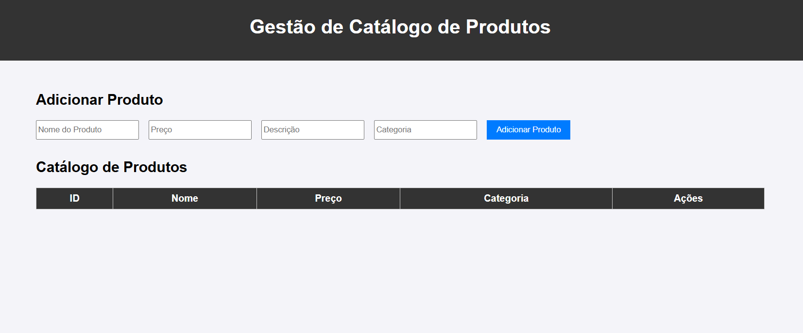
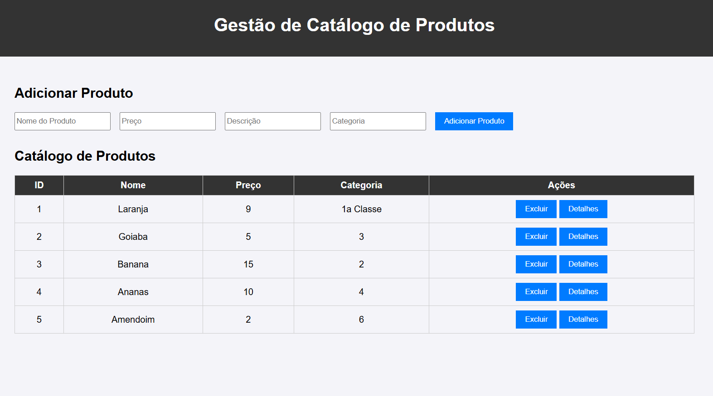

# Gestao-de-catalogo-de-produtos

 # Boa tarde a todos! 🖐️ meu nome é Matukondele Mvuilo Moisés.

# Este é o web application para Gestão de catálogo de produtos
### Foi desenvolvido este sistema de gestão de catálogo de produtos para uma loja virtual. Este sistema será usado pelos administradores da loja para registar, listar, editar e excluir produtos, além de obter infor
mações adicionais sobre os produtos através de uma API externa. 
Neste desenvolvimento, utilizei conceitos de Programação Orientada a 
Objetos (POO), AJAX, JSON e API. Acredito que com a concepção deste sistema, vai minimizar o tempo de gestão dos produtos vendidos na loja virtual...

## Tecnologias utilizadas: HTML, CSS e JAVASCRIPT

## O link do aplicativo: https://gestao-de-catalogo-de-produtos.vercel.app/

